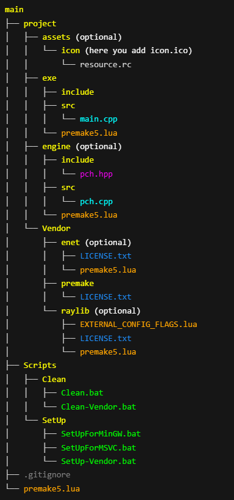
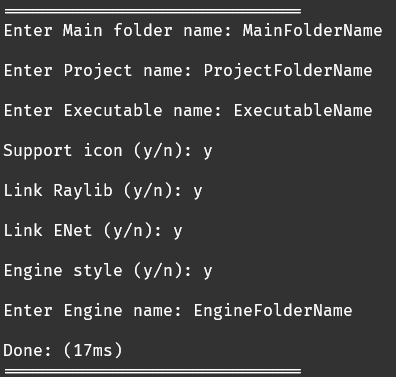

## `prj.exe` quickly creates C++ projects with a clean and consistent structure.

## 🚀 Features

- Choose folder names (`main`, `project`, `exe`, optional `engine`)
- Optional features:
  - Icon support  
  - Raylib integration  
  - ENet integration  
  - Engine mode (`.lib` separation with `pch.hpp`)
- Setup scripts to:
  - Download dependencies (Premake, Raylib, ENet)
  - Generate project files for MSVC or MinGW
- Clean scripts to:
  - Remove generated files
  - Remove downloaded dependencies

## 🛠️ How to Use

1. Run `prj.exe`
2. Follow the prompts to configure your project
3. Run the setup scripts to prepare the project (start with `SetUp-Vendor`)

## 📦 Requirements

- Git  
- Curl and Tar  
- C++ Compiler (MSVC or MinGW)

## 🔮 What's Next

- [ ] Refactor and split logic into modular files  
- [ ] Allow adding any library, not just Enet or Raylib  
- [ ] Add support for saving custom `premake5.lua` for external libraries  
- [ ] Add support for Linux (build scripts and environment)

> ⚠️ This roadmap is subject to change.